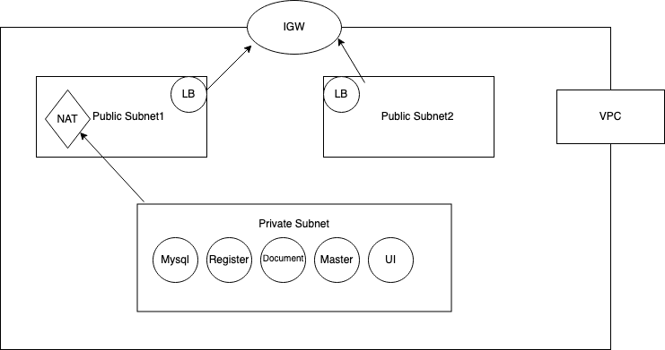

# upgradassignment
# Upgrad labs application

An application to register for medical lab activites

## Getting started

Download [Docker Desktop](https://www.docker.com/products/docker-desktop) for Mac or Windows. 

Once these are installed follow the steps
```
 * Create docker images for backend, frontend and mysql database using the repo
 * Tag and Push the images to AWS ECR
 * Use these images in the ECS applation
 ```



Create a security group and open the following ports to 0.0.0.0/0 Use the same security across all the services
```
    Front end -> 3000
    Document -> 8082
    Register -> 8090
    Master -> 8080
    Mysql -> 3306
```

 Use the following environment variables in the ECS containers
 ```
   ## Mysql
    database_name  -> upgradpg
    database_password -> upgradpg
    database_username -> upgradpg
    MYSQL_ROOT_PASSWORD	 -> root
    Open port 3306

    Document service
    MYSQL_HOST	-> private ip of the mysql service
    Open port -> 8082

    Master service
    MYSQL_HOST	-> private ip of the mysql service
    Open port -> 8080

    Register service
    MYSQL_HOST	-> private ip of the mysql service
    Open port -> 8090

    Front end
    REACT_APP_DOCSVC_HOST -> private ip of documet service
    REACT_APP_MASTERSVC_HOST -> private ip of master service
    REACT_APP_REGSVC_HOST ->  private ip of register service
    Open port -> 3000
``` 

## Once all the services are up access the application using http://alb:3000
